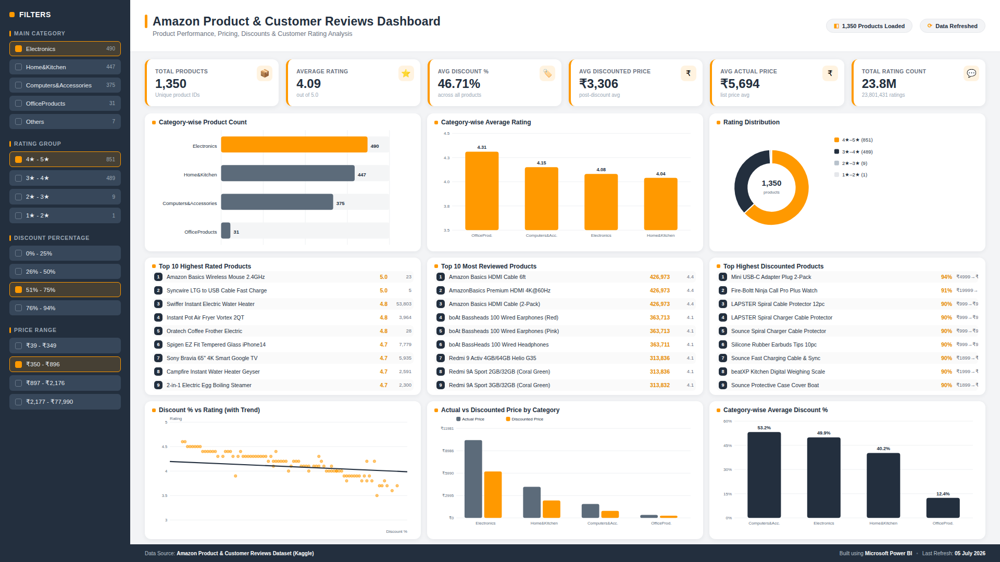

# Amazon Product & Customer Reviews Dashboard

A Power BI–style dashboard built from a real Amazon products & reviews dataset (Kaggle). Covers pricing, discounts, ratings, and review volume across categories — all numbers pulled and validated straight from the raw CSV.

## Live Demo
Enable GitHub Pages on this repo (Settings → Pages → deploy from `main`) and it'll be live at:
`https://ashwinkhade.github.io/amazon-dashboard/`

Or just open `index.html` in any browser — no installs, no dependencies, nothing to run.

## What's in it

**KPIs**
- Total Products: 1,350 (deduplicated from 1,465 raw rows — a bunch of rows were just repeat reviews on the same product)
- Average Rating: 4.09 / 5.0
- Average Discount: 46.71%
- Average Discounted Price: ₹3,306
- Average Actual Price: ₹5,694
- Total Rating Count: 23.8M

**Charts**
- Category-wise product count
- Category-wise average rating
- Rating distribution (donut)
- Top 10 highest rated products
- Top 10 most reviewed products
- Top highest discounted products
- Discount % vs rating scatter, with trend line
- Actual vs discounted price by category
- Category-wise average discount %

## A few things worth knowing about the data

- Categories were wildly uneven — Electronics, Home&Kitchen, Computers&Accessories, and OfficeProducts made up almost the whole dataset. The rest had 1–2 products each, so they got left out of the charts instead of padded out with noise.
- Discount and rating barely correlate (-0.16). Cheaper doesn't really mean worse-rated in this data, and heavier discounts don't buy better reviews either.
- A couple of rows had missing ratings or review counts. Those got excluded from the averages rather than guessed at.

## Tech

Single HTML file. Charts are hand-drawn SVG — no Chart.js, no CDN, nothing that can break if a network request fails. Styled to match Power BI's look: Amazon orange, dark navy, rounded cards, soft shadows, Segoe UI.

## Data Source
[Amazon Product & Customer Reviews Dataset — Kaggle](https://www.kaggle.com/datasets/karkavelrajaj/amazon-sales-dataset)

Built by [ashwinkhade](https://github.com/ashwinkhade)
